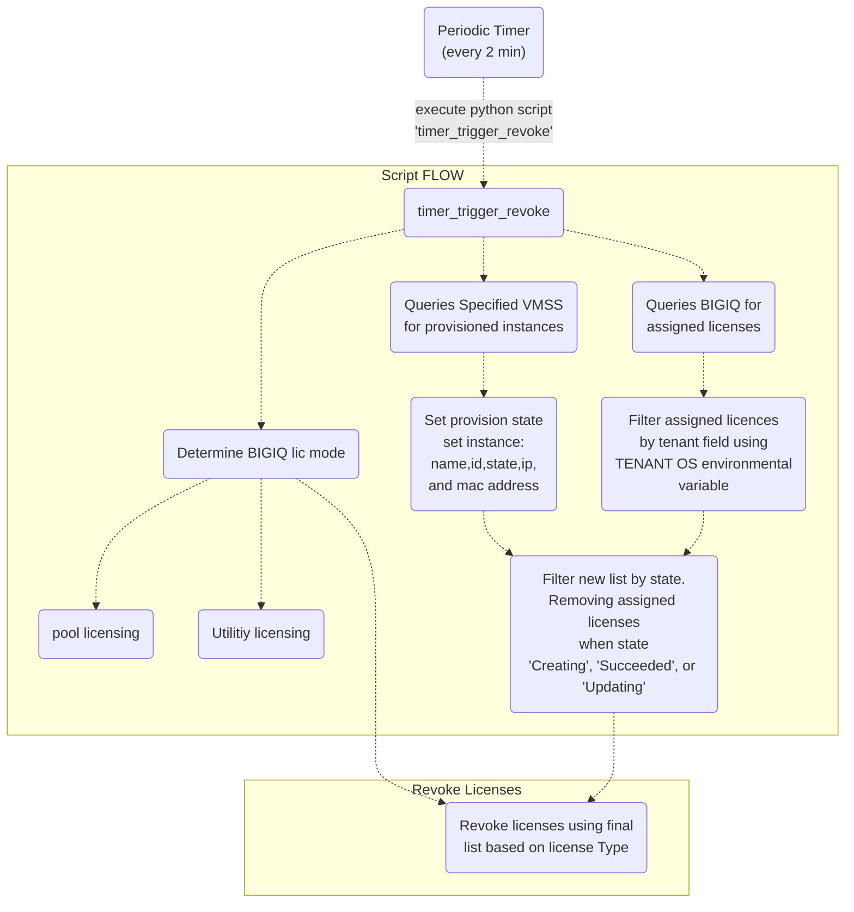

## Contents

- [Introduction](#introduction)
- [Prerequisites](#prerequisites)
- [Flow Chart](#flow-chart)

# Introduction

This is the Azure function-as-a-service for revoking BIG-IQ license assignments.

# Prerequisites
## Azure
- Storage account: Any SKU is fine
- Linux server farm:
  - kind: linux
  - properties.reserved: true
- Function app:
  - identity.type: SystemAssigned
  - properties.siteConfig.linuxFxversion: PYTHON|3.7
  - properties.serverFarmId: Should be a reference to the aforementioned server farm
- Function appsettings resource:
  - APPINSIGHTS_INSTRUMENTATIONKEY: The key to connect to Azure App Insights for telemetry streaming
  - AZURE_RESOURCE_GROUP: The name of the resource group where the VM scale set is deployed
  - AZURE_VMSS_NAME: The name of the VM scale set
  - AzureWebJobsStorage: Pointer to a storage account where queues are stored
  - BIGIQ_ADDRESS: The IP address of the BIG-IQ system where VM scale set instances are licensed
  - BIGIQ_LICENSE_POOL: The name of the registration key pool, if applicable
  - BIGIQ_PASSWORD: Pointer to the Key Vault secret where the BIG-IQ password is stored
  - BIGIQ_USERNAME: The username for the BIG-IQ system
  - BIGIQ_UTILITY_KEY: The utility registration key, if applicable 
  - BIGIQ_UTILITY_OFFER: The utility offer UUID, if applicable
  - F5_DISABLE_SSL_WARNINGS: Set to true if the BIG-IQ system is using a self-signed SSL certificate
  - FUNCTIONS_EXTENSION_VERSION: ~3
  - FUNCTIONS_WORKER_RUNTIME: python
  - TENANT: The name of the tenant that was specified when licensing the VM scale set instances
  - WEBSITE_ENABLE_SYNC_UPDATE_SITE: true
  - WEBSITE_NODE_DEFAULT_VERSION: ~12
- Function app virtualNetworkConnections resource:
  - properties.vnetResourceId: Should be a reference to an empty subnet located in the same virtual network as, or a virtual network that can route to, the BIG-IQ system; see https://docs.microsoft.com/en-us/azure/app-service/web-sites-integrate-with-vnet for more information 
- Key Vault:
  - Must have an access policy that grants get access to secrets to the tenantId and principalId of the function app system assigned identity
- Secret:
  - Contains the BIG-IQ password
- Application Insights

# F5
- BIG-IQ 6.1.0
- Registration key pool or utility license
- Tenant property specified for each license assignment

## Flow Chart

Flow Chart
 
 
 

 
 
 

## Copyright

Copyright 2014-2020 F5 Networks Inc.

## License

### Apache V2.0

Licensed under the Apache License, Version 2.0 (the "License"); you may not use
this file except in compliance with the License. You may obtain a copy of the
License [here](http://www.apache.org/licenses/LICENSE-2.0).

Unless required by applicable law or agreed to in writing, software
distributed under the License is distributed on an "AS IS" BASIS,
WITHOUT WARRANTIES OR CONDITIONS OF ANY KIND, either express or implied.
See the License for the specific language governing permissions and limitations
under the License.

### Contributor License Agreement

Individuals or business entities who contribute to this project must have
completed and submitted the F5 Contributor License Agreement.